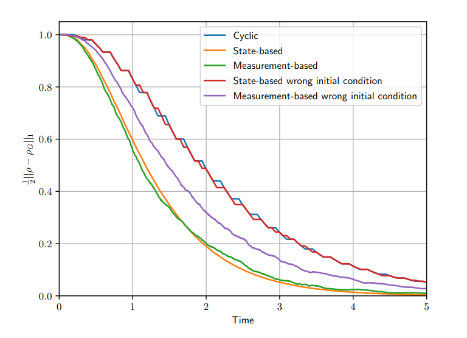
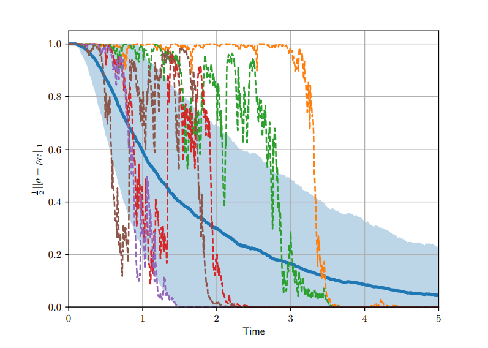
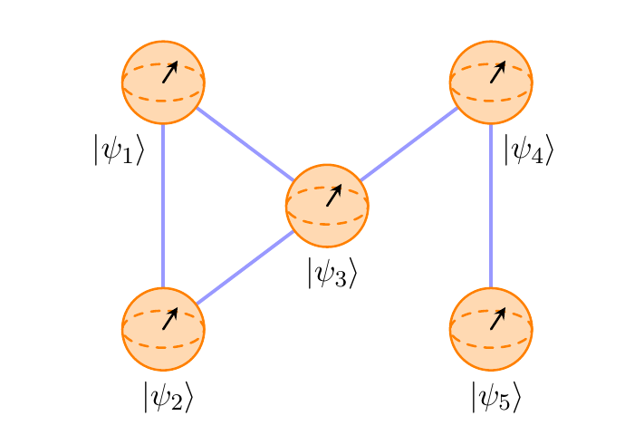

Hello my name is
# Tommaso Grigoletto
This website acts as my online resume.

## About me
I am an automation engineer and currently a Ph.D. student at the University of Padua. 

My research interests are in the field of control system theory. Topics of interest include: most importantly quantum information and control but also non-linear systems and the use of machine learning methods as a tool to study and control complex systems.

# Pubblications

- **[Stabilization via feedback switching for quantum stochastic dynamics.](https://arxiv.org/abs/2012.08712)**
Grigoletto, Tommaso, and Francesco Ticozzi. IEEE Control Systems Letters (2021).

  
   
  

- **[Image compression by means of the multidimensional circulant covariance extension problem–Revisited.](https://arxiv.org/abs/2009.02508)**
Benciolini, Tommaso, Tommaso Grigoletto, and Mattia Zorzi. 2020 59th IEEE Conference on Decision and Control (CDC). IEEE, 2020.

